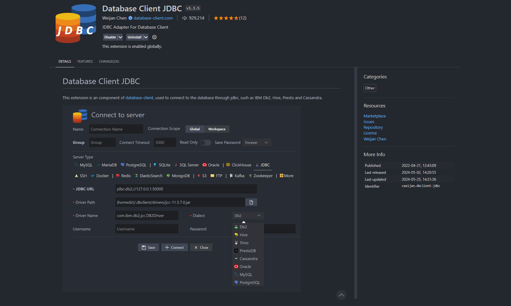

<h1 align="left">Praktikum Basis Data 2024</h1>

###

Menggunakan Visual Studio code dengan extension Database Client JDBC atau menggunakan tools lain seperti XAMPP.

###

<h1 align="left">Extension yang Digunakan</h1>

###

Berikut ini adalah extension yang digunakan

###

  

###

<h1 align="left">How to Run</h1>

###

@BLOCK sebagai pemisah antar perintah, sehingga bisa langsung di jalankan pastikan sudah terkoneksi dengan mysql buat database terlebih dahulu di terminal untuk koneksi dengan extension untuk praktikum ini menggunakan aplikasi xamp

###